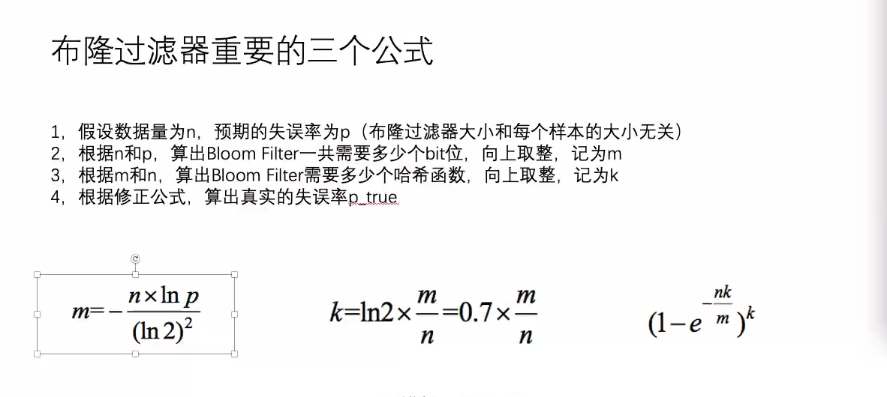

## 哈希函数

### 哈希函数的作用：可以把数据根据不同值，几乎均匀的分开
哈希函数：相同的输入，必定有相同的输出

> 哈希函数可以将数据根据不同值，均匀的分开，
> 如果需要几乎均匀的分开到指定的长度上，那么只需要对哈希值取模即可

- 举例：哈希表的设计

#### 哈希表

- 为什么哈希表的增删改查都是O(1)时间复杂度   
    因为当有N个key的时候，每次都是库容2倍，那么扩容的次数为logN,
    总体的key扩容的代价为2N，时间复杂度是O(N)，因为总共有N个key,
    所以时间复杂度就是O(N)/N, 单次的代价就是O(1)。

    > 有N个key插入到哈希表，虽然每次有扩容，需要将所有的元素重新rehash，但是单词扩容的时间复杂度就是O(1)

- 红黑树优化相对于经典的数据+链表来讲，只是优化了常数项时间复杂度，每次的增删改查的代价仍然是O(1)

#### 布隆过滤器
1. 利用哈希函数性质
2. 加入一条数据提取特征
3. 加入描黑库（就是将指定下标位置的位数组的二进制设置为1）

- 布隆过滤器的位数组长度和什么有关
    - 样本量
    - 失误率

- 布隆过滤器的位数组长度如何确定   
  
- 如何确定若干个哈希函数
    - 找到2个哈希函数
    - 剩下的若干个哈希函数为：  
        1\*f1 + f2  
        2\*f1 + f2  
        3\*f1 + f2  
        ...

- 应用举例：亿级url过滤

- 扩展：布谷鸟过滤器

#### 一致性哈希
**哈希环**   
分布式存储结构最常见的结构

1. 哈希域变成环的设计
2. 虚拟节点技术
    - 虚拟节点技术既能实现负载均衡，也能实现负载管理，
      当某个机器性能较好，那么虚拟节点就多一些，某个机器就可以少一些
